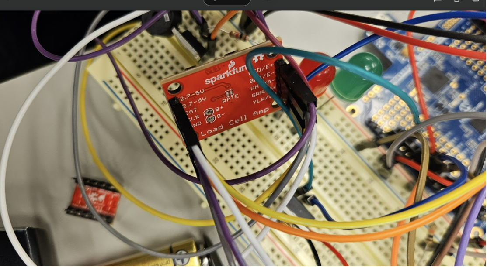

# dhanushi08.github.io

# final-project-skeleton

    * Team Name: Stack Smasher
    * Team Members: Dhanushi Prajapati, Kiet Cao
    * Github Repository URL: https://github.com/upenn-embedded/final-project-stack-smasher.git
    * Github Pages Website URL: https://github.com/dhanushi08/dhanushi08.github.io
    * Description of hardware: (embedded hardware, laptop, etc) 

## Final Project Report

Don't forget to make the GitHub pages public website!
If you’ve never made a Github pages website before, you can follow this webpage (though, substitute your final project repository for the Github username one in the quickstart guide):  <https://docs.github.com/en/pages/quickstart>

### 1. Video
Final demo

https://github.com/user-attachments/assets/283e7a23-c10d-405f-a6f1-28e63bf9a87a

https://drive.google.com/file/d/1W4wfd8CjCQm8gnFRA5z4OIDHXie12oS7/view?usp=sharing

MVP demo

https://github.com/user-attachments/assets/ef13f535-53f4-447c-adf8-4f77b51be552

[Demo_Cup_Holder](https://drive.google.com/drive/u/0/folders/12cd8FE63KlAuQI8P4MwIefSKOULvxkxN)

### 2. Images
Full setup

Ultrasonic sensor

Strain gauge

HX711

New 3D printed frame

Buzzer

LCD + LED

Battery + regulator

#### Quick recap
  1/ Three class topics you covered:

   Timers (PWM, Input capture, output compare, etc.)

   Interrupts

   ADC

   Serial/wireless communication

   Power management ( a bit )
  
2/ Input device

   Strain gauge + load cell amplifier, ultrasonic sensor

3/ Output Device
   
   LCD, LEDs, , buzzer

4/ Complexity (what was difficult in your project and on what things did you spend a large amount of time?)

Our project went pretty ok. The biggest issue was the late arrival of the parts (strain gauge and LCD out of stock). The calibration process was an issue as well because the strain gauges do not show consistency and depend on how we set up the prototype as well. . In the code development process, we reckon that continuous weight monitoring is a big burden on energy and alarm can be annoying. Thus, we set a ultrasonic sensor to detect the presence of the cup as like a switch to start/stop the process and it well fairly well. If anything can be done differently then it would be to order a backup as well, and start prototyping early plus make a better abstract for the code then it would be easier to notice flaws in the design/logic. A pretty cool small adjustment is that we can use a 9V battery to power the system which turns out much easier than expected and add nice portability. Next step can possibly be to encapsulate the design in sort of a cylinder with minimal area and further optimize the energy consumption.

5/ Integration (what things broke when you put them together and how did you deal with it?)

Our first prototype was a wooden block base and a steel cup holder. It broke probably because the wooden block was not too stable. Then we replaced that prototype with a 3d printed one. We made the cad design using tinkercad software and submitted it to the venture lab to get 3d prints. The 3d printed model worked fine. 

We got the strain gauge working well on the prototype with minimal errors and can check up to 2kg. However, when we try to use the new 3D printing parts we just got on Dec 5th, the strain gauge shows some weird behavior with its accuracy still fine but only up to 300g then it shows weird behaviours. We attributed the cause to either the strain gauge/wiring or the bit conversion issue.

### 3. Results

What were your results? Namely, what was the final solution/design to your problem?

The problem we want to solve is common hydration issue when people forget to drink water frequently. To solve this issue, we plan to design a compact smart cup holder. The user will first place a cup in, and the ultrasonic sensor will detect the cup presence and start the process. In the process, the weight of the cup will be monitored continuously and set a drinking status of either "Hydrated" or "Drink now". In hydrated state, the LED will remain green and timer starts. If any change significant (Drinking by straw eg) then timer will be reset. If not then at a mark of like 15 minutes, the timer will trigger an interrupt and change the check flag on so the current weight of the cup will be compared with the previous weight from last check. If there is minimal change below some threshold such as 50 ml then it will trigger an alarm, turning on the buzzer and switching LED to red. Also, a missing amount value compared to what should user drink will be printed and status on LCD changed to "Drink now". To remove this state, user can either take the cup up and drink (ultrasonic will check and system turned off during this time, LCD print "Away" but time counter and previous weight will be kept). When placed the cup back, the system on again and comparison made between previous value and new value and if the difference big enough then state changed to "Hydrated". A 9V battery will power the MCU which will power all peripherals. Ultrasonic sensor starts timer and strain gauge measurement or not to save energy.The block diagram and specigic logic is included below:

System Block Diagram

1.	Ultrasonic Sensor Integration:
 
•	The system uses an ultrasonic sensor to detect the presence of a cup.

•	If the cup is detected within a threshold distance (DISTANCE_THRESHOLD = 15 cm), the system activates hydration tracking.

•	If the cup is not detected, the system pauses monitoring and displays "Away" on the LCD.
 
2.	Weight Monitoring via HX711:
 
•	The HX711 load cell amplifier reads the weight of the water cup.

•	The system calculates water consumption by comparing the current weight (currentWeight) with the previous weight (previousWeight).

•	If the weight drops by more than 10%, the system assumes the user has consumed water and resets the timer.
 
3.	Hydration Reminder:
 
•	If no significant weight change (above some value) is detected for a predefined interval (set in Timer1), the system triggers a hydration reminder.

•	This reminder includes:

•	A buzzer alert (3 seconds).

•	Red LED activation to indicate "Drink Now".

•	LCD display updates to "Drink Now" and print a missing value 
 
4.	Feedback Mechanisms:
 
•	The LCD displays:

•	Current weight of the cup.

•	Hydration status ("Hydrated!!" or "Drink Now").

•	Missing water amount

•	"Away" when the cup is removed.

•	UART outputs debug information such as distance, current weight, previous weight, and timer counters.
 
5.	Timers for Periodic Monitoring:
 
•	A timer is used to periodically check if the user has consumed water. The interval is currently set to 10 seconds for demo purposes.

•	If the timer expires without weight changes, the hydration reminder is triggered.

#### 3.1 Software Requirements Specification (SRS) Results

Based on your quantified system performance, comment on how you achieved or fell short of your expected software requirements. You should be quantifying this, using measurement tools to collect data.

We achieved all 5 key SRS for a functional design with the 6th optional SRS to connect to IoT currently left.

• SRS01: Continuous distance measurement with ultrasonic sensor and turn on weighting and timer for alarm/buzzer/LCD if object placed in

•	SRS02: Convert the data from HX711 to weight with options to record offset and calibrate

•	SRS03: Check weight each 15 minutes after last check or last drink

•	SRS04: Alert with buzzer and switch LED to red if user have not drink by the check time

•	SRS05: Print current device status, drinking status, current weight, and missing drinking amount on LCD 

•	SRS06: Connect to wifi or local gateway to send data to IoT platform to analyze and send user email about drinking behavior (optional) - Not Done

#### Show how you collected data and the outcomes
•	SRS01

We set the distance, weight, and timer to be printed continuously in uart. And the LCD will update device status to be away or on depending on distance.

It can be seen that the weight, status, and time will only be printed if distance fall below threshold.
Similarly, in demo, it can be seen that the LCD will switch status to Away and no update on weight anymore if remove the cup.

•	SRS02

An offset function is set to record the ADC value converted from 24 bit at the start (approx 40000) then the weight will be calculated by current ADC value minus the offset and divided by a calibration factor (can be edited). In SRS02 figure, the weight is around 0g at the start as it is the noise difference between ADC value and offset. The calibration and accuracy test process is in HRS02

•	SRS03

Timer 1 is utilized with overflow enabled. For a prescaler of 256 at frequency 16MHz, each overflow means approximately 1s and this allows us to specify the period between each check of our scale. For instance, we set a variable overflow counter for timer 1 and if the counter goes above period value 10 (10s between each measurement), it will trigger an interrupt and set checkFlag to 1 and the system will check if the value of weight has changed or not and alert accordingly. This way, we can easily set the time interval by changing the period value (max overflow counter). When there is change in weight, the counter will be reset. We checked this by printing the counter via uart as in SRS01 figure

•	SRS04 + 05

When time is up and no noticeable change in weight, the buzzer will be triggered and red LED turns on. 

This is demonstrated in the video. In addition, a variable called missing will be recorded to save how much water the user missed so far and display on screen. If the missing value goes above the current weight of the cup then it will print “Please refill”
#### 3.2 Hardware Requirements Specification (HRS) Results

Based on your quantified system performance, comment on how you achieved or fell short of your expected hardware requirements. You should be quantifying this, using measurement tools to collect data.

Yes, we have achieved all key HRS 01-05 with 2 optional HRS to use ESP32 for IoT and RTC for timer not completed but do not affect key functionalities:

• HRS01: The ultrasonic sensor can differentiate when cup placed in or not (need to reliably detect with at least 10cm gap between 2 scenarios)

•	HRS02: Stable and accurate weight measurement from strain gauge (less than 5 percent error versus a scale)

•	HRS03: Period between each check has to be close to intended period (less than 10% error, check with stopwatch)

•	HRS04: Reliable LCD display updates and alerts (4 lines of status and messages printed on LCD and updated every check or change in weight/distance)

•	HRS05: 9V battery pack + buck regulators (5V + 3.3V) to supply for atmega 

#### Show how you collected data and the outcomes.
• HRS01

For distance measurement, we do not require too precise measurement. The key point is to recognize whether the cup/bottle is placed in or not.  From our trials, we noticed that the distance measurement will be down to 6-9 cm when the cup is placed in and will go to very large if nothing is nearby or if there is the person standing next to the device then the distance measurement will be around 25-30 cm. Thus, we set a threshold of 15 cm (below that means the cup is placed in).

The distance printed over uart. It can be seen that when the cup is placed in, distance drops to 8 and 6, and the weight starts getting printed. When the cup is removed, distance goes above threshold and stop taking weight measurement and pause the timer.

•	HRS02

The offset ADC value is recorded at the start when nothing placed in then the weight will be (the current ADC value - the offset) and divided by the calibration factor. The calibration factor is manually determined by comparing the weight by the system versus the weight by the scale. (the factor is 220 by trials and can be adjusted easily for different environments). 

Below table is the trials at 220 trial ( the cup weight measured by the scale and then put on the gauge - weight shown on LCD)

| Trial No | Scale (g) | Cup Holder (g) |
|----------|-----------|----------------|
| 1        | 170.0     | 168.5          |
| 2        | 160.0     | 159.6          |
| 3        | 225.0     | 228.0          |
| 4        | 118.0     | 118.5          |

The measurement discrepancy is at most 2% in trials, less than 5% benchmark as specified in HRS.

•	HRS03

Using the phone stopclock, we measured the gap between the measurements (through listenting to gap between buzzer rings) to be around 11.0s for period 10s and 62.8s for period 60s. The error is less than 10% but manual timing maybe a off so it can be less.

•	HRS04

All lines printed as intended and updates can be seen in demo video

•	HRS05
Battery setup (9V Battery + 5V regulator LM340T5) -

5V achieved and MCU + peripherals run normally

### 4. Conclusion

Reflect on your project. Some questions to consider: What did you learn from it? What went well? What accomplishments are you proud of? What did you learn/gain from this experience? Did you have to change your approach? What could have been done differently? Did you encounter obstacles that you didn’t anticipate? What could be a next step for this project?

Our project went pretty ok. The biggest issue was the late arrival of the parts (strain gauge and LCD out of stock). However, our code development and calibration process went well with the mechanical parts prototyped from simple wood and plate (our 3D printing just arrived and maybe installed soon). In the code development process, we reckon that continuos weight monitoring is a big burden on energy and alarm can be annoying. Thus, we set a ultrasonic sensor to detect the presence of the cup as like a switch to start/stop the process and it well fairly well. If anything can be done differently then it would be to order a backup as well, and start prototyping early then it would be easier to notice flaw in the design/logic. A pretty cool small adjustment is that we can use a 9V battery to power the system which turns out much easier than expected and add nice portability. Next step can possibly be to encapsulate the design in sort of a cylinder with minimal area and further optimize the energy consumption.

## MVP Demo
### System Block Diagram

### Firmware implementation including application logic

1.	Ultrasonic Sensor Integration:
 
•	The system uses an ultrasonic sensor to detect the presence of a cup.

•	If the cup is detected within a threshold distance (DISTANCE_THRESHOLD = 15 cm), the system activates hydration tracking.

•	If the cup is not detected, the system pauses monitoring and displays "Away" on the LCD.
 
2.	Weight Monitoring via HX711:
 
•	The HX711 load cell amplifier reads the weight of the water cup.

•	The system calculates water consumption by comparing the current weight (currentWeight) with the previous weight (previousWeight).

•	If the weight drops by more than 10%, the system assumes the user has consumed water and resets the timer.
 
3.	Hydration Reminder:
 
•	If no significant weight change (above some value) is detected for a predefined interval (set in Timer1), the system triggers a hydration reminder.

•	This reminder includes:

•	A buzzer alert (3 seconds).

•	Red LED activation to indicate "Drink Now".

•	LCD display updates to "Drink Now" and print a missing value 
 
4.	Feedback Mechanisms:
 
•	The LCD displays:

•	Current weight of the cup.

•	Hydration status ("Hydrated!!" or "Drink Now").

•	Missing water amount

•	"Away" when the cup is removed.

•	UART outputs debug information such as distance, current weight, previous weight, and timer counters.
 
5.	Timers for Periodic Monitoring:
 
•	A timer is used to periodically check if the user has consumed water. The interval is currently set to 10 seconds for demo purposes.

•	If the timer expires without weight changes, the hydration reminder is triggered.

### Have you achieved some or all of your Software Requirements Specification (SRS)?
Yes, we have achieved the following:

• SRS01: Continuous distance measurement with ultrasonic sensor and turn on weighting and timer for alarm/buzzer/LCD if object placed in

•	SRS02: Convert the data from HX711 to weight with options to record offset and calibrate

•	SRS03: Check weight each 15 minutes after last check or last drink

•	SRS04: Alert with buzzer and switch LED to red if user have not drink by the check time

•	SRS05: Print current device status, drinking status, current weight, and missing drinking amount on LCD

#### Show how you collected data and the outcomes
•	SRS01

We set the distance, weight, and timer to be printed continuously in uart. And the LCD will update device status to be away or on depending on distance.

It can be seen that the weight, status, and time will only be printed if distance fall below threshold.
Similarly, in demo, it can be seen that the LCD will switch status to Away and no update on weight anymore if remove the cup.

•	SRS02

An offset function is set to record the ADC value converted from 24 bit at the start (approx 40000) then the weight will be calculated by current ADC value minus the offset and divided by a calibration factor (can be edited). In SRS02 figure, the weight is around 0g at the start as it is the noise difference between ADC value and offset. The calibration and accuracy test process is in HRS02

•	SRS03

Timer 1 is utilized with overflow enabled. For a prescaler of 256 at frequency 16MHz, each overflow means approximately 1s and this allows us to specify the period between each check of our scale. For instance, we set a variable overflow counter for timer 1 and if the counter goes above period value 10 (10s between each measurement), it will trigger an interrupt and set checkFlag to 1 and the system will check if the value of weight has changed or not and alert accordingly. This way, we can easily set the time interval by changing the period value (max overflow counter). When there is change in weight, the counter will be reset. We checked this by printing the counter via uart as in SRS01 figure

•	SRS04 + 05

When time is up and no noticeable change in weight, the buzzer will be triggered and red LED turns on. 

This is demonstrated in the video. In addition, a variable called missing will be recorded to save how much water the user missed so far and display on screen. If the missing value goes above the current weight of the cup then it will print “Please refill”

### Have you achieved some or all of your Hardware Requirements Specification (HRS)?

Yes, we have achieved the following:

• HRS01: The ultrasonic sensor can differentiate when cup placed in or not (need to reliably detect with at least 10cm gap between 2 scenarios)

•	HRS02: Stable and accurate weight measurement from strain gauge (less than 5 percent error versus a scale)

•	HRS03: Period between each check has to be close to intended period (less than 10% error, check with stopwatch)

•	HRS04: Reliable LCD display updates and alerts (4 lines of status and messages printed on LCD and updated every check or change in weight/distance)

•	HRS05: 9V battery pack + buck regulators (5V + 3.3V) to supply for atmega 

#### Show how you collected data and the outcomes.
• HRS01

For distance measurement, we do not require too precise measurement. The key point is to recognize whether the cup/bottle is placed in or not.  From our trials, we noticed that the distance measurement will be down to 6-9 cm when the cup is placed in and will go to very large if nothing is nearby or if there is the person standing next to the device then the distance measurement will be around 25-30 cm. Thus, we set a threshold of 15 cm (below that means the cup is placed in).

The distance printed over uart. It can be seen that when the cup is placed in, distance drops to 8 and 6, and the weight starts getting printed. When the cup is removed, distance goes above threshold and stop taking weight measurement and pause the timer.

•	HRS02

The offset ADC value is recorded at the start when nothing placed in then the weight will be (the current ADC value - the offset) and divided by the calibration factor. The calibration factor is manually determined by comparing the weight by the system versus the weight by the scale. (the factor is 220 by trials and can be adjusted easily for different environments). 

Below table is the trials at 220 trial ( the cup weight measured by the scale and then put on the gauge - weight shown on LCD)

| Trial No | Scale (g) | Cup Holder (g) |
|----------|-----------|----------------|
| 1        | 170.0     | 168.5          |
| 2        | 160.0     | 159.6          |
| 3        | 225.0     | 228.0          |
| 4        | 118.0     | 118.5          |

The measurement discrepancy is at most 2% in trials, less than 5% benchmark as specified in HRS.

•	HRS03

Using the phone stopclock, we measured the gap between the measurements (through listenting to gap between buzzer rings) to be around 11.0s for period 10s and 62.8s for period 60s. The error is less than 10% but manual timing maybe a off so it can be less.

•	HRS04

All lines printed as intended and updates can be seen in demo video

•	HRS05
Battery setup (9V Battery + 5V regulator LM340T5) -

5V achieved and MCU + peripherals run normally

### Show off the remaining elements that will make your project whole: mechanical casework, supporting graphical user interface (GUI), web portal, etc.

•	IoT Integration (optional): Push hydration data to a cloud portal for tracking over time.

•	Mechanical casework: will pick up 3D printings and make the design more neat
•	Try remove the parts from the breadboard one by one

### Demo your device

[Demo_Cup_Holder](https://drive.google.com/drive/u/0/folders/12cd8FE63KlAuQI8P4MwIefSKOULvxkxN)

For demo, we will show the following :

1.	The system detects the presence of the cup to start the weighting and timer

2.	Weight updates on the LCD when water is added or removed

3.	The hydration reminder (buzzer LED and missing drinking amount) if the user doesn’t drink water within the interval

### What is the riskiest part remaining of your project?

We don’t believe there are any significant risks remaining in our project, as all critical components have been tested and are functioning as expected. However, the IoT integration could pose a potential minor risk, as it is technically challenging to implement and depends on external factors like network connectivity and data transmission reliability. Since the IoT component is optional, it does not impact the core functionality of the project.

#### How do you plan to de-risk this?

To address this, we will ensure a stable Wi-Fi connection is available during the demonstration. Additionally, since implementing IoT can be complex, we plan to seek guidance and support from our assigned TA to troubleshoot any issues. If the IoT feature cannot be fully implemented or encounters connectivity issues, the project can still demonstrate its primary features and functionality effectively without it.

### What questions or help do you need from the teaching team?

•	Would implementing an IoT portal for data tracking be a good extension for the project?

•	Any feedback on making the system more user-friendly?

## Sprint review #2

### Current state of project
Finished LCD and buzzer, timer functionality and integrated into full code

Just obtained strain gauge, need to test and calibrate

Need to adjust and optimize main code for MVP demo

### Last week's progress 
Finished skeleton code for entire system (ADC+LCD+Buzzer)

Prepared 3D printing file (waiting for dimension finalizing)

Got the main strain gauge and LCD components on Friday

### Next week's plan
Test and calibrate strain gauge

Finish main code and optimize functionality

Submit file for 3D printing

Make MVP demo

### Proof of work
Combined code for buzzer LCD and ADC value added. The ADC value will be recorded every minute, if the value drops below 80% of previous value, buzzer will ring and LED change to red and vice versa. The LCD will display current value and hydrated status every minute. (ADC value for now from photoresistor)
 
Code in [link](buzzerADCLCDcombined.c)

Video demo at https://drive.google.com/file/d/1QNiT4zd12bgpwR_Y9k2QXiOIVlwzZHgY/view?usp=sharing

3D printing file:

## Sprint review #1

### Current state of project
Setting up functionality and code

Buzzer + LED functionality tested

Prototype pending

Waiting for orders

### Last week's progress 
Tested code for buzzer and LED to alert user if value unchanged after a duration, video demo on github

Got access to venture and attended training

Made a skeleton code for weight ADC reading

Battery option (for now USB will do, testing battery once it arrives)

### Next week's plan
Test the parts after they arrive (strain gauge (Dhanushi) and LCD (Kiet))

Figure out the design of the plate and make a CAD drawing to send for 3D printing (both)

Quick prototype with cardboard and plate for preliminary trial

### Proof of work

[buzzer_test_skeleton](buzzer_test_skeleton.c) 
Green light signifies normal drinking, if not drinking (weight value unchanged) in 30s then buzze rings and red LED on.

Video link:
https://drive.google.com/file/d/1OzOUZltArUcJL2sXFMrPkX0yAlhyobjZ/view?usp=sharing

[Straingauge_testcode](Straingauge_testcode.c)

## Sprint review trial

### Current state of project
1. Modification of the functionalities and designs
2. BOM finished

### Last week's progress
For this week, we made improvements to our design, specifically in the HRS and SRS. Along with picking the components needed, we got more clear about what we need in terms of communication and assembling. Thus, we modified the functionality to be more suitable such as how the ADC values will be sampled, or changing the battery to 9V to satisfy voltage requirement even when battery voltage is running low.

### Next week's plan
Our plans for next week will be to try out and test some functionalities. If the parts have arrived, we will begin working on our project.
1. Test buzzer or LED to alert user
2. Program code to test the strain gauge through ADC. Test it if components arrive

## Final Project Proposal

### 1. Abstract

Thirst Track is a smart cup holder that helps solve this problem by tracking how much water you drink and reminding you when it’s time for a sip through alarm and how much you should at least drink on LCD screen.

### 2. Motivation

In our busy lives, it’s easy to forget to drink enough water, even though it’s important for health and energy. Many people struggle to stay hydrated because they get caught up in daily tasks. This project is interesting because it uses simple technology to help people develop better hydration habits. By making it easy to monitor water intake, Thirst Track supports health goals and helps people build a routine of staying hydrated

### 3. Goals

1: Identifying Hardware components, setup and assemble

2: Programming and testing each component

3: IoT connectivity (Optional) and system refinement

### 4. System Block Diagram

### 5. Design Sketches

### 6. Software Requirements Specification (SRS)
Periodically checking weight change of water bottle to alert users to drink and how much.

User: Anyone with bottle up to 128 oz or any type of cup

Key functionality:

• SRS01: Continuous distance measurement with ultrasonic sensor and turn on weighting and timer for alarm/buzzer/LCD if object placed in

•	SRS02: Convert the data from HX711 to weight with options to record offset and calibrate

•	SRS03: Check weight each 15 minutes after last check or last drink

•	SRS04: Alert with buzzer and switch LED to red if user have not drink by the check time

•	SRS05: Print current device status, drinking status, current weight, and missing drinking amount on LCD

•	SRS06: Connect to wifi or local gateway to send data to IoT platform to analyze and send user email about drinking behavior (optional)

### 7. Hardware Requirements Specification (HRS)

Simple sensor-utilized system supplied by battery + regulator with peripherals to alert user.

User: Anyone with bottle up to 128 oz or any type of cup

• HRS01:	The ultrasonic sensor can differentiate when cup placed in or not (need to reliably detect with at least 10cm gap between 2 scenarios)

•	HRS02: Stable and accurate weight measurement from strain gauge (less than 5 percent error versus a scale)

•	HRS03: Period between each check has to be close to intended period (less than 10% error, check with stopwatch)

•	HRS04: Reliable LCD display updates and alerts (4 lines of status and messages printed on LCD and updated every check or change in weight/distance)

•	HRS05: 9V battery pack + buck regulators (5V + 3.3V) to supply for atmega and esp32 

•	HRS06: ESP32 module receive uart data and send through wifi to IoT platform (optional)

•	HRS07: Receive current time via I2C from RTC IC to use for checking time between drinks + send to esp (optional)

### 8. Components

1. ATmega328pb 
2. Strain gauge load cell (10kg) 
3. Hx711 amplifier board 
4. LCD 
5. Buzzer (Provided)
6. ESP32  (Provided)
7. 9V battery pack (alkaline)
8. Battery snap connector
9. 5V regulator
10. 3.3V regulator
11. RTC IC

BOM: https://docs.google.com/spreadsheets/d/1d7LTL5dJPbNYvJ3TELnlZtbxUHyJK-bZJzqmcYYAmig/edit?usp=sharing

### 10. Final Demo

1. Weight value data changed and recorded with different weights on
2. LCD display adjusted recommendation each time change weight
3. Buzzer alerts if no change in weight for intended time
4. (Optional) Graphs and notifications about drinking behavior on IoT platforms

### 10. Methodology

1. Finalize design
2. Purchase components
3. Program and test each hardware functionality
4. Prototype and assemble design
5. Test and calibrate sensor + algorithm
6. (Optional) Try send to IoT platform if enough time

### 10. Evaluation

1. Weight measurement error less than 5% real value
2. Value recorded each time weight value changed more than 5% and every period
3. LCD can display message about recommended consumption and next drinking time
4. Buzzer do alert if time between drinks exceeded
5. (Optional) IoT platform held data about daily drinking time and amount + send notification

### 12. Proposal Presentation

Add your slides to the Final Project Proposal slide deck in the Google Drive.

## References

Fill in your references here as you work on your proposal and final submission. Describe any libraries used here.

## Github Repo Submission Resources

You can remove this section if you don't need these references.

* [ESE5160 Example Repo Submission](https://github.com/ese5160/example-repository-submission)
* [Markdown Guide: Basic Syntax](https://www.markdownguide.org/basic-syntax/)
* [Adobe free video to gif converter](https://www.adobe.com/express/feature/video/convert/video-to-gif)
* [Curated list of example READMEs](https://github.com/matiassingers/awesome-readme)
* [VS Code](https://code.visualstudio.com/) is heavily recommended to develop code and handle Git commits
  * Code formatting and extension recommendation files come with this repository.
  * Ctrl+Shift+V will render the README.md (maybe not the images though)
